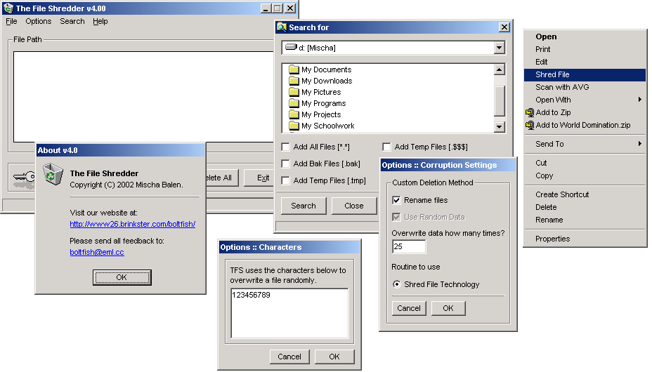



## The File Shredder 4\.0

### Description

TFS overwrites every character in a file with random data (this data is specified by the user) up to several hundred times before randomly renaming the file and then killing it. This means that it can't be recovered from your hard drive - it really is a secure delete! As every character is overwritten, it's secure, but a little slow. TFS can also scan for temp files and adds a right click context menu to your files. If you like this code, please vote or leave a message!! Thanks.
 
### More Info
 

             |
---                |---
**Submitted On**   |2002-08-30 13:47:38
**By**             |[boltfishy](https://github.com/Planet-Source-Code/PSCIndex/blob/master/ByAuthor/boltfishy.md)
**Level**          |Advanced
**User Rating**    |4.6 (41 globes from 9 users)
**Compatibility**  |VB 6\.0
**Category**       |[Files/ File Controls/ Input/ Output](https://github.com/Planet-Source-Code/PSCIndex/blob/master/ByCategory/files-file-controls-input-output__1-3.md)
**World**          |[Visual Basic](https://github.com/Planet-Source-Code/PSCIndex/blob/master/ByWorld/visual-basic.md)
**Archive File**   |[The\_File\_S1244978302002\.zip](https://github.com/Planet-Source-Code/boltfishy-the-file-shredder-4-0__1-38492/archive/master.zip)

